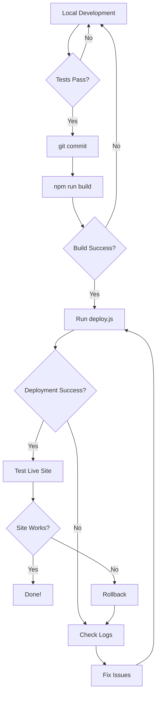

# 🚀 Deployment Documentation - Tasty Food Hub

Complete guide for deploying your React Vite application to Hostinger hosting.

---

## 📋 Table of Contents

1. [Quick Start](#quick-start)
2. [Prerequisites](#prerequisites)
3. [Automated Deployment](#automated-deployment)
4. [Manual Deployment](#manual-deployment)
5. [Configuration](#configuration)
6. [Troubleshooting](#troubleshooting)
7. [Hosting Information](#hosting-information)

---

## 🎯 Quick Start

### Option A: Automated Deployment (Recommended)

```bash
# 1. Install dependencies
npm install

# 2. Configure FTP credentials
cp .env.example.deploy .env.deploy
# Edit .env.deploy and add your FTP_PASS

# 3. Deploy
node deploy.js
```

### Option B: Manual Deployment

See [deploy-manual.md](./deploy-manual.md) for complete step-by-step instructions using FileZilla.

---

## 📦 Prerequisites

### Required Software

- **Node.js** 18 or higher
- **npm** 9 or higher
- **Git** (for version control)

### For Automated Deployment

Install deployment dependencies:

```bash
npm install basic-ftp dotenv chalk --save-dev
```

### For Manual Deployment

- **FileZilla Client** ([Download](https://filezilla-project.org/))

---

## 🤖 Automated Deployment

The automated deployment script handles the entire deployment process.

### Setup

1. **Create environment file:**

```bash
cp .env.example.deploy .env.deploy
```

2. **Edit `.env.deploy` with your credentials:**

```env
FTP_HOST=72.60.93.15
FTP_USER=u487930812_tastyfood.me
FTP_PASS=your_actual_password_here
FTP_REMOTE_PATH=/public_html/dist
DOMAIN=https://tastyfood.me
```

3. **Add to `.gitignore`:**

```bash
echo ".env.deploy" >> .gitignore
```

### Running the Script

```bash
node deploy.js
```

### What the Script Does

1. ✅ Builds the Vite project (`npm run build`)
2. ✅ Verifies `dist/` folder structure
3. ✅ Connects to FTP server with retry logic
4. ✅ Clears old files from remote directory
5. ✅ Uploads all new files to `/public_html/dist/`
6. ✅ Verifies remote file structure
7. ✅ Generates deployment report with timestamps
8. ✅ Tests that site loads correctly

### Expected Output

```
🚀 Starting deployment to Hostinger...

→ [16:30:15] Building Vite project...
✓ [16:30:42] Build completed successfully
→ [16:30:42] Verifying dist/ folder structure...
✓ [16:30:42] Found 125 files/folders in dist/
→ [16:30:42] Connecting to FTP server (attempt 1/3)...
✓ [16:30:44] FTP connection established
→ [16:30:44] Clearing old files from remote directory...
✓ [16:30:46] Cleared 98 items from remote directory
→ [16:30:46] Uploading files to remote server...
✓ [16:33:12] Successfully uploaded 125 files
→ [16:33:12] Verifying remote file structure...
✓ [16:33:14] Remote structure verified successfully

✓ DEPLOYMENT SUCCESSFUL!

═══════════════════════════════════════════════════════════
                    DEPLOYMENT REPORT                      
═══════════════════════════════════════════════════════════

Timeline:
  Start:    1/22/2026, 4:30:15 PM
  End:      1/22/2026, 4:33:14 PM
  Duration: 179.23s

Summary:
  Steps:    12
  Errors:   0
  Warnings: 0

Access your site:
  https://tastyfood.me

═══════════════════════════════════════════════════════════
```

### Deployment Report

After each deployment, a JSON report is saved:

```
deployment-report-[timestamp].json
```

Contains:
- Deployment timeline
- All steps executed
- Errors encountered
- Warnings issued
- Upload statistics

---

## 📝 Manual Deployment

For complete manual deployment instructions using FileZilla, see:

**[deploy-manual.md](./deploy-manual.md)**

Quick summary:

1. Build: `npm run build`
2. Connect FileZilla to `72.60.93.15`
3. Navigate to `/public_html/dist/`
4. Upload all files from local `dist/` folder
5. Set file permissions (644 for files, 755 for folders)
6. Test site at https://tastyfood.me

---

## ⚙️ Configuration

### Vite Configuration

Ensure your `vite.config.ts` has correct base path:

```typescript
export default defineConfig({
  base: '/dist/', // If files are in /public_html/dist/
  // OR
  base: '/', // If .htaccess redirects root to /dist/
  
  build: {
    outDir: 'dist',
    assetsDir: 'assets',
    sourcemap: false, // Disable for production
    minify: 'terser',
    rollupOptions: {
      output: {
        manualChunks: {
          'react-vendor': ['react', 'react-dom', 'react-router-dom'],
        }
      }
    }
  }
});
```

### .htaccess Configuration

Place in `/public_html/.htaccess`:

```apache
# Redirect to /dist/ folder
RewriteEngine On
RewriteCond %{REQUEST_URI} !^/dist/
RewriteRule ^(.*)$ /dist/$1 [L]

# SPA Routing
RewriteCond %{REQUEST_FILENAME} !-f
RewriteCond %{REQUEST_FILENAME} !-d
RewriteRule ^dist/(.*)$ /dist/index.html [L]

# Security Headers
<IfModule mod_headers.c>
    Header set X-Content-Type-Options "nosniff"
    Header set X-Frame-Options "SAMEORIGIN"
    Header set X-XSS-Protection "1; mode=block"
    Header set Referrer-Policy "strict-origin-when-cross-origin"
</IfModule>

# GZIP Compression
<IfModule mod_deflate.c>
    AddOutputFilterByType DEFLATE text/html text/plain text/xml text/css text/javascript application/javascript application/json
</IfModule>

# Browser Caching
<IfModule mod_expires.c>
    ExpiresActive On
    ExpiresByType image/* "access plus 1 year"
    ExpiresByType text/css "access plus 1 month"
    ExpiresByType application/javascript "access plus 1 month"
    ExpiresByType text/javascript "access plus 1 month"
</IfModule>
```

---

## 🔧 Troubleshooting

### Common Issues

#### 1. **Blank White Screen After Deployment**

**Symptoms:** Site loads but shows blank white page

**Causes:**
- Incorrect base path in Vite config
- Missing or incorrect .htaccess
- Files in wrong directory

**Solutions:**
```bash
# Check browser console for errors (F12)
# Look for 404 errors on .js and .css files

# Verify base path matches deployment structure
# If files are in /public_html/dist/, use base: '/dist/'
# Update vite.config.ts, rebuild, and redeploy
```

---

#### 2. **404 Error on Page Refresh**

**Symptoms:** Homepage works, but refreshing any other page shows 404

**Cause:** Missing or incorrect SPA routing in .htaccess

**Solution:**
```apache
# Add to .htaccess
RewriteEngine On
RewriteCond %{REQUEST_FILENAME} !-f
RewriteCond %{REQUEST_FILENAME} !-d
RewriteRule ^dist/(.*)$ /dist/index.html [L]
```

---

#### 3. **CSS/JS Not Loading (MIME Type Error)**

**Symptoms:** Browser console shows: "Refused to apply style... MIME type ('text/html')"

**Cause:** Server returning HTML (404 page) instead of CSS/JS files

**Solutions:**
1. Verify files uploaded to correct directory
2. Check file permissions (644 for files)
3. Clear browser cache (Ctrl+Shift+Delete)
4. Verify .htaccess RewriteRule doesn't catch asset requests

---

#### 4. **FTP Connection Failed (Automated Deployment)**

**Symptoms:** Script can't connect to FTP server

**Solutions:**
```bash
# Verify credentials in .env.deploy
cat .env.deploy

# Test connection manually with FileZilla first

# Check firewall isn't blocking FTP (port 21)

# Try different FTP hostname
FTP_HOST=tastyfood.me  # Instead of IP
```

---

#### 5. **Upload Fails Mid-Way**

**Symptoms:** Some files upload, then process stops

**Solutions:**
1. Check internet connection stability
2. Increase timeout in deploy.js:
   ```javascript
   TIMEOUT: 60000  // Increase to 60 seconds
   ```
3. Upload manually via FileZilla for large files
4. Check Hostinger disk space (hPanel → Files)

---

#### 6. **Old Version Still Showing**

**Symptoms:** Site shows old content after deployment

**Solutions:**
```bash
# Clear browser cache completely
# Chrome: Ctrl+Shift+Delete, select "All time"

# Hard refresh
# Windows: Ctrl+Shift+R
# Mac: Cmd+Shift+R

# Test in incognito/private mode

# Clear Hostinger cache (if using Cloudflare):
# hPanel → Cloudflare → Purge Cache
```

---

### Debug Mode

Enable verbose FTP logging in deploy.js:

```javascript
const client = new Client();
client.ftp.verbose = true; // Enable debug output
```

This will show all FTP commands and responses.

---

## 🏢 Hosting Information

### Hostinger Account Details

| Property | Value |
|----------|-------|
| **Domain** | tastyfood.me |
| **Server** | server2067 |
| **Location** | Europe (France) |
| **IP Address** | 72.60.93.15 |
| **Disk Space** | 50 GB |
| **RAM** | 1536 MB |
| **CPU Cores** | 2 |

### FTP Credentials

| Property | Value |
|----------|-------|
| **Host** | 72.60.93.15 or ftp.tastyfood.me |
| **Port** | 21 |
| **Username** | u487930812_tastyfood.me |
| **Password** | (stored in .env.deploy) |
| **Root Path** | /public_html |
| **Deploy Path** | /public_html/dist |

### DNS Configuration

| Property | Value |
|----------|-------|
| **Primary NS** | ns1.dns-parking.com |
| **Secondary NS** | ns2.dns-parking.com |

### Control Panel

- **hPanel:** [https://hpanel.hostinger.com](https://hpanel.hostinger.com)
- **File Manager:** hPanel → Files → File Manager
- **FTP Accounts:** hPanel → Files → FTP Accounts
- **SSL:** Managed by Hostinger (Auto-renewing Let's Encrypt)

---

## 📊 Deployment Workflow

### Recommended Workflow



### Best Practices

1. **Always test locally first**
   ```bash
   npm run dev  # Test development
   npm run build && npm run preview  # Test production build
   ```

2. **Use version control**
   ```bash
   git add .
   git commit -m "feat: add new feature"
   git push
   ```

3. **Keep backups**
   - Download current `/public_html/dist/` before deploying
   - Save to `backups/` folder with timestamp

4. **Monitor deployment**
   - Watch console output for errors
   - Check deployment report after completion
   - Test site immediately after deployment

5. **Gradual rollout**
   - Deploy to staging first (if available)
   - Test all critical paths
   - Then deploy to production

---

## 🔐 Security Best Practices

1. **Never commit credentials**
   ```bash
   # Ensure .env.deploy is in .gitignore
   echo ".env.deploy" >> .gitignore
   ```

2. **Use strong FTP password**
   - Minimum 16 characters
   - Mix of uppercase, lowercase, numbers, symbols
   - Change regularly

3. **Enable SSL/HTTPS**
   - Hostinger provides free SSL
   - Force HTTPS in .htaccess:
   ```apache
   RewriteEngine On
   RewriteCond %{HTTPS} off
   RewriteRule ^(.*)$ https://%{HTTP_HOST}%{REQUEST_URI} [L,R=301]
   ```

4. **Set correct file permissions**
   - Files: 644 (rw-r--r--)
   - Folders: 755 (rwxr-xr-x)

5. **Disable directory listing**
   ```apache
   Options -Indexes
   ```

---

## 📈 Performance Optimization

### Pre-Deployment

1. **Optimize images**
   ```bash
   # Use tools like imagemin or squoosh.app
   # Target: < 100KB per image
   ```

2. **Enable code splitting**
   ```javascript
   // Lazy load routes
   const Home = lazy(() => import('./pages/Home'));
   ```

3. **Remove console logs**
   ```javascript
   // In vite.config.ts
   build: {
     minify: 'terser',
     terserOptions: {
       compress: {
         drop_console: true
       }
     }
   }
   ```

### Post-Deployment

1. **Enable Cloudflare** (via Hostinger hPanel)
   - Free CDN
   - DDoS protection
   - Auto minification

2. **Monitor with Google PageSpeed Insights**
   - https://pagespeed.web.dev/
   - Target: > 90 score

3. **Set up monitoring**
   - Uptime Robot: https://uptimerobot.com/
   - Google Analytics
   - Error tracking (Sentry, LogRocket)

---

## 📞 Support & Resources

### Hostinger Support

- **24/7 Live Chat:** [hPanel](https://hpanel.hostinger.com)
- **Knowledge Base:** [support.hostinger.com](https://support.hostinger.com)
- **Email:** support@hostinger.com
- **Average Response Time:** < 5 minutes (live chat)

### Useful Links

- **Hostinger Tutorials:** [www.hostinger.com/tutorials](https://www.hostinger.com/tutorials)
- **Vite Documentation:** [vitejs.dev](https://vitejs.dev)
- **React Documentation:** [react.dev](https://react.dev)
- **FileZilla Wiki:** [wiki.filezilla-project.org](https://wiki.filezilla-project.org)

### Community

- **Hostinger Community:** [community.hostinger.com](https://community.hostinger.com)
- **Stack Overflow:** Tag `hostinger`, `vite`, `react`

---

## 📝 Changelog

### v1.0.0 - January 22, 2026
- Initial deployment system
- Automated deployment script
- Manual deployment guide
- Comprehensive documentation
- Error handling and logging
- Deployment reports

---

## 📄 License

This deployment toolkit is part of Tasty Food Hub project.  
Internal use only.

---

**Last Updated:** January 22, 2026  
**Maintained By:** Tasty Food Development Team  
**Version:** 1.0.0
